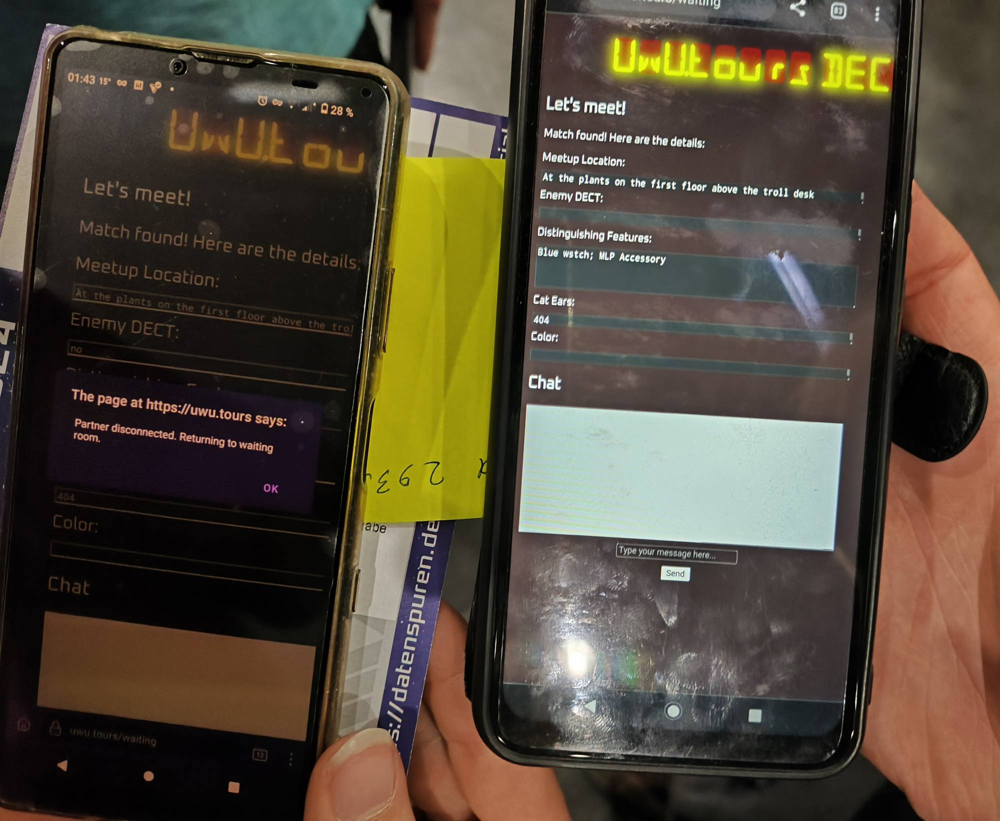
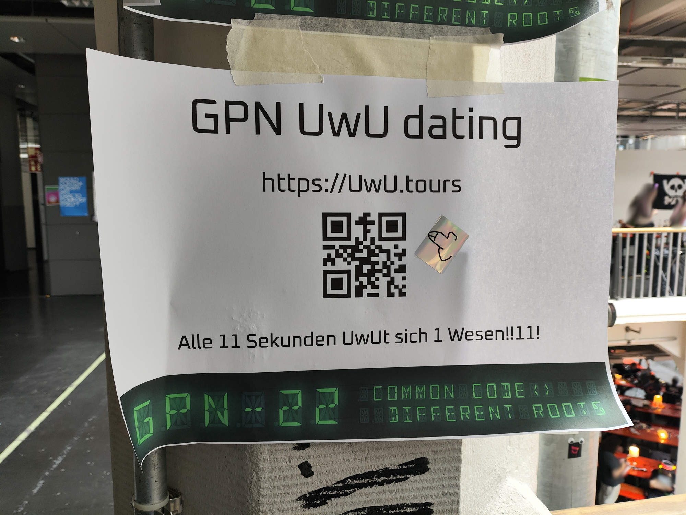

# Welcome to UwU.tours Dating-Platform! ✨

<table><tr>
<td>  </td>
<td>  </td>
</tr></table>

## What is UwU.tours?

UwU.tours is a straightforward dating platform for events. It is only usable locally and requires no registration. You scan the QR code or go to UwU.tours. There, you specify your gender (UwU, OwO, ÚwÙ, ..., Diverse), indicate whether you are serious about dating, provide a short description of yourself, and then you enter the waiting room. As soon as a second person enters the room, the two are matched and both are given one of ~10-30 meeting points at the event. Additionally, the description of the other person is displayed, and there is a chat feature.

## History

On the train on the way to Gulaschprogrammiernacht 2024, larsmm and jarainf stumbled upon UwU.dating while searching for domains (it eventually became UwU.tours because UwU.dating was too expensive). This sparked the idea to create a straightforward dating platform for the GPN. After a few hours of work, a bug-ridden Python-Flask-SocketIO-Rooms construct was created and went online on day 2. Ten signs with QR codes were printed, and then it got exciting. What had worked well in tests with 2 people revealed numerous bugs with more users. Nevertheless, it was somehow usable and brought a lot of joy to people.

Now it's time to fix the bugs, improve comfort and features. The system will definitely be used again at upcoming events!

## Ideas for Improvements

- Mobile view
- Reconnect on connection loss
- Do not discard chat view after connection loss
- Statistics
- Do something with the answered questions
- Improve the README
- Add sign template to the git repository